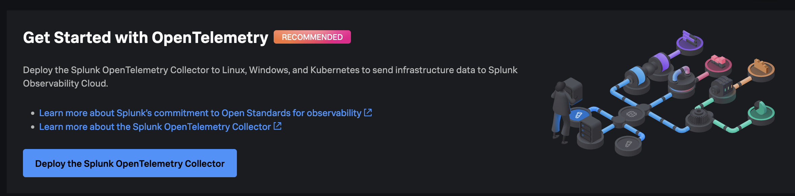
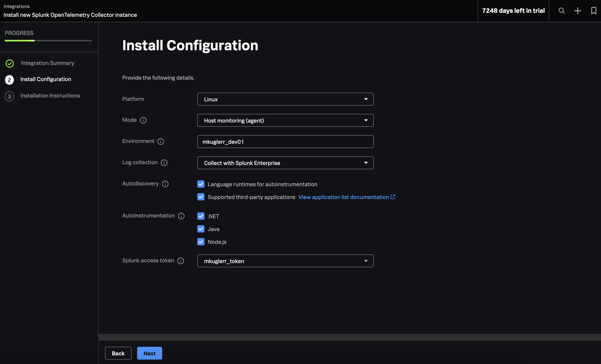
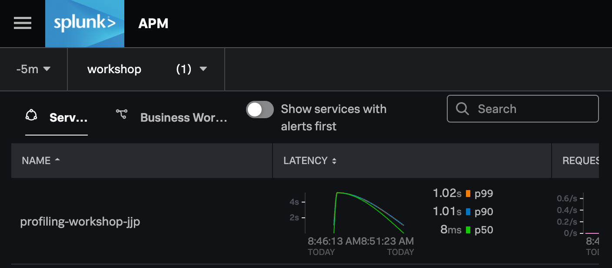
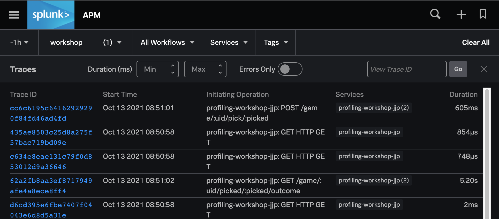

# AlwaysOn Profiling + RUM Workshop

## Part 1: Getting Started

In this section, we will learn how to build and run the
sample application and how to ingest telemetry through the collector.

### Clone the repo

From a new shell, clone this repo by running the following:

```
$ git clone https://github.com/Cisco-Observability-TME/SplunkObs-profiling-RUM.git

$ cd SplunkObs-profiling-RUM/workshop
```
The rest of the workshop will take place in this directory.

### Build the example service

Time to build the sample application service. Run the following to create
a single runnable jar.

```
$ ./gradlew shadowJar
```

Near the end of the output it should say `BUILD SUCCESSFUL`. Let's make sure the jar
got built:

```
$ ls -l build/libs/
total 6152
-rw-r--r--  1 user  group   2.8M Nov 01 14:01 profiling-workshop-all.jar
```


Great! We now have an executable jar containing our sample app. We will run it shortly,
but first we need to...

### Fire up a Collector locally

You can run the collector in many different environments like docker or kubernetes. For this example, we will use the linux service option and it will run as a regular linux process in agent mode. This will collect linux metrics and provides us with infrastructure level visibility.

More information about the collector:
https://docs.splunk.com/observability/en/gdi/opentelemetry/opentelemetry.html#otel-intro

Guided install for the Collector
Splunk Observability Cloud offers a guided setup to install the Collector:


1. Log in to Splunk Observability Cloud.
2. In the navigation menu, select Data Management.
3. Go to the Available integrations tab, or select Add Integration in the Deployed integrations tab.
4. Select one of the platforms in the Splunk OpenTelemetry Collector section.
5. Follow the step-by-step process provided in the platform's guided setup.



Run the following command to install the OpenTelemetry Collector to capture metrics and traces and enable profiling:
Change `<SPLUNK_TOKEN>` for youractual token value:

curl -sSL https://dl.signalfx.com/splunk-otel-collector.sh > /tmp/splunk-otel-collector.sh && \
sudo sh /tmp/splunk-otel-collector.sh --realm us1 -- <SPLUNK_TOKEN> --mode agent --with-instrumentation --deployment-environment mkuglerr_dev01 --discovery --enable-profiler --enable-profiler-memory --enable-metrics

The collector's main configuration file is located at /etc/otel/collector/agent_config.yaml,
and the environment file is located at /etc/otel/collector/splunk-otel-collector.conf.

Now we can restart the collector. 

```
$ sudo systemctl restart splunk-otel-collector
```

If successful, we can check the status of the service. Confirm that it is working by running:

```
$ sudo systemctl status splunk-otel-collector
```


### Run the application

Now it's time to run the application. In order to identify your application instance from 
other workshop participants, we need to select a service name. Recommend choosing 
`profiling-workshop-<xxx>` where `<xxx>` are your initials or username. Use this
service name in the command below:

```
$ java  \
    -Dotel.resource.attributes=deployment.environment=mkuglerr_env01 \
    -Dotel.service.name=profiling-workshop-mkuglerr \
    -jar build/libs/profiling-workshop-all.jar
```

To verify that the service is working, visit http://yourip:9090. You should be
met with The Door Game intro screen. Play through a couple of times to get the 
feel for the application flow... and then play many times to ensure there are enough spans to create usable Profiling data...

Good luck!

### Confirm spans are being ingested

We can first check in on the collector to verify that it is receiving trace data.
Let's look in the logs:

```
$ journalctl -u splunk-otel-collector
```

Near the bottom of the logs you should hopefully see output that looks like this:

```
2021-10-12T23:19:20.004Z	INFO	loggingexporter/logging_exporter.go:41	TracesExporter	{"#spans": 2}
```

You should see one or more lines like the above and no errors. If you have errors, 
check that you have started the collector with the correct token and realm
(as shown above). 


It's time to see the service in APM. [Visit this link](https://app.signalfx.com/#/apm?endTime=Now&environments=workshop&filter=&job=full&startTime=-15m)
and scroll to the bottom to see the list of services.



Find your service in the list and click the name to visit the Troubleshooting view, then click
"Traces" on the right-hand side of the screen. This will take you to the list of traces for 
your service:



Feel free to look at some of the traces and get a brief sense of the web/REST operations
performed by the service.

# Conclusion of Part 1

Go ahead and play a few games. Have you noticed any slowness in certain areas of the
gameplay? (Hint: try using door 3 as your final choice).

## What did we accomplish?

* We performed the initial workshop setup.
* We learned how to run the collector locally and how verify its proper operation by inspecting the logs.
* We learned how to build and start the sample application.
* We learned how to wire up the latest Splunk java instrumentation to our sample application.
* We learned how to find our service in APM in the Splunk Observability Cloud and how to view trace details.

## Next steps

[Click here to go on to part 2](02_enable_profiler.md), where we 
will enable the profiler and look at its output.
